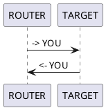

#**_
Tools :)
_**
##MAC CHANGER

### Requirements
net-tools\
`apt install net-tools`\
scapy\
`sudo pip3 install scapy`

###Usage
@params\
-h --help
-i --iface  interface to change\
-m --mac new MAC

##ARP SPOOFER
@params\
-h --help\
--target-ip     IP to target interface\
--gateway-ip    IP to target gateway

@IMPORTANT
Allow ip_forwarding\
`echo 1 > /proc/sys/net/ipv4/ip_forward`

##PACKET SNIFFER
###requirements
`sudo pip3 install scapy_http`

@params\
-h --help
--iface     Interface to sniff on

